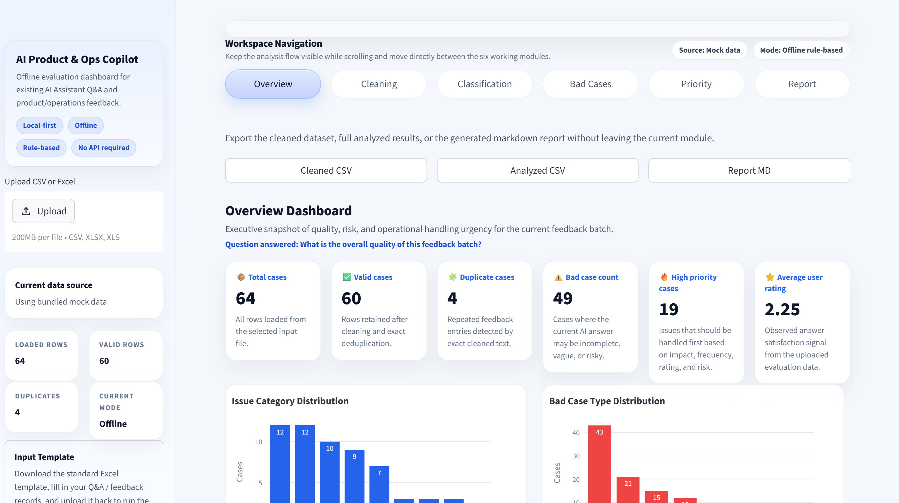
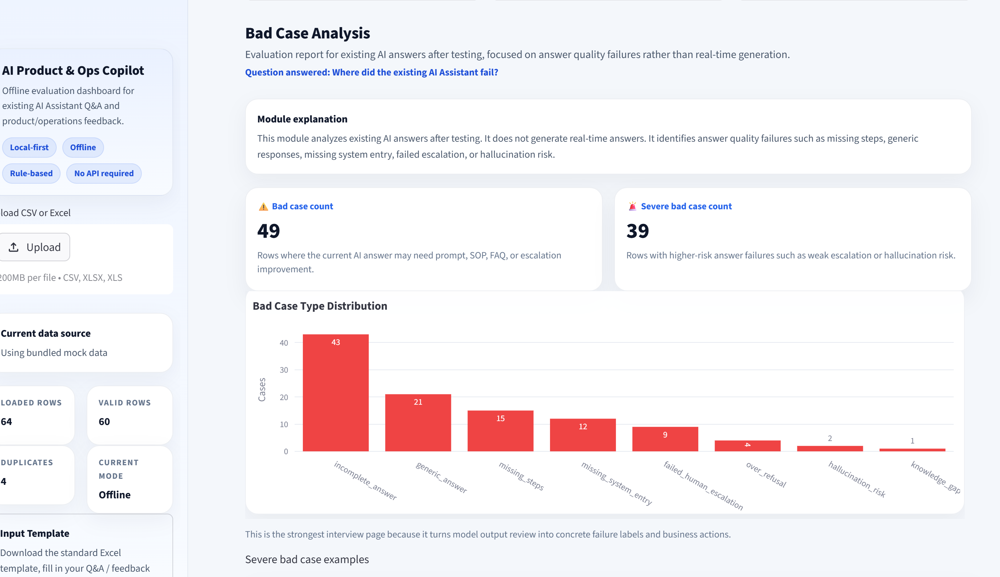
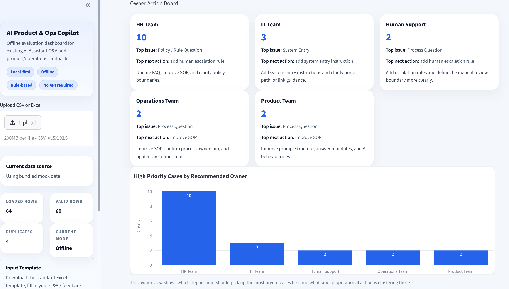
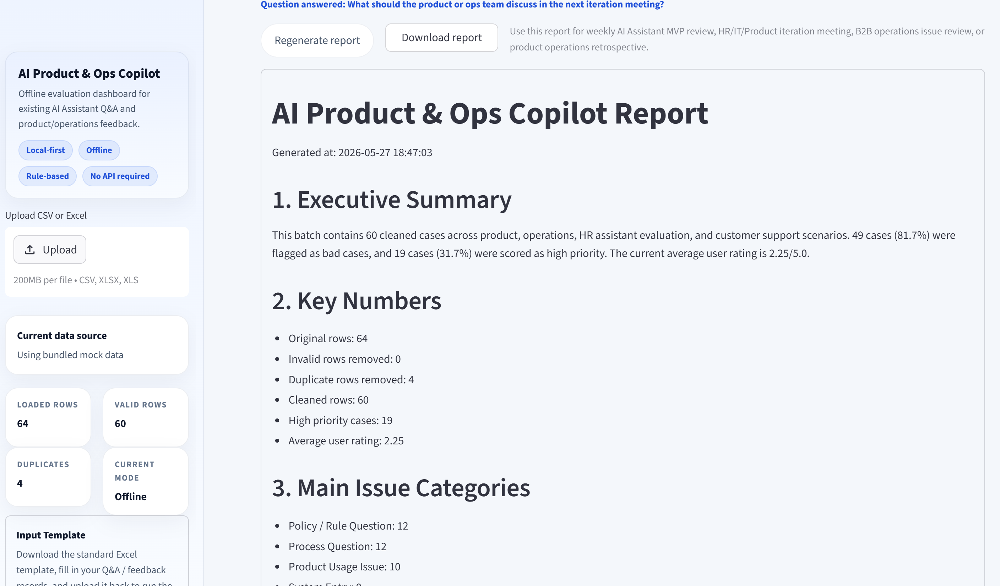

# AI Product & Ops Copilot

[](https://www.python.org/)
[](https://streamlit.io/)
[](#api-boundary)
[](LICENSE)

[English Version](README.md)

AI Product & Ops Copilot 是一个面向现有 AI Assistant 问答结果与业务反馈记录的本地优先离线评估面板。它不会实时生成回答，而是把已有的测试记录、用户反馈、运营问题和支持对话整理成结构化分析、责任归属建议与下一步迭代动作。


## 项目定位

这个项目是一个针对现有 AI Assistant 问答输出的离线评估与迭代工具，不是聊天机器人本体。

第一版没有实现 RAG 或 Agent，也不是实时 AI Agent。它可以接收一个已有的 RAG / ReAct 风格 AI Assistant 的输出结果，帮助团队识别问题类别、坏案例、优先级和责任团队。

## Demo 预览

以下截图展示了 AI Product & Ops Copilot 的主要分析流程：从整体数据概览、Bad Case 分析、优先级分诊，到最终复盘报告生成。

### Overview Dashboard｜整体概览



整体概览页面用于快速查看当前反馈批次的质量情况，包括总案例数、有效案例数、重复案例数、Bad Case 数量、高优先级问题数量、平均用户评分以及问题类型分布。

### Bad Case Analysis｜错误案例分析



Bad Case 分析页面用于识别现有 AI Assistant 回答中的问题，例如流程步骤缺失、系统入口缺失、回答过于泛化、未及时转人工以及潜在幻觉风险。

### Priority Scoring｜优先级分诊



优先级页面将识别出的 Bad Case 转化为运营处理优先级，展示哪些问题应该优先处理、由哪个团队负责，以及下一步建议采取什么动作。

### Report Generator｜复盘报告生成



报告生成页面会输出一份面向业务复盘的 Markdown 报告，可用于 AI Assistant MVP 周期复盘、HR/IT/Product 迭代会议、B2B 运营问题复盘或产品运营总结。

## 项目动机

很多 AI 产品和运营团队已经能收集用户反馈，但真正困难的是把这些零散记录转成可执行的迭代动作。这个项目的目标，是用一个适合面试展示的 MVP 证明：即使不依赖外部 API，也可以把原始记录转成结构化分析、责任分配建议和会议可用的总结报告。

## 适用业务场景

- AI Assistant MVP 测试与复盘
- HR AI Assistant 评估
- B2B 运营问题分析
- 产品与客服反馈分析
- 电商商家运营反馈分析

## Demo 使用流程

1. 本地启动应用。
2. 直接使用内置 mock 数据，或上传 CSV / XLSX / XLS 文件。
3. 先看 Overview，快速说明这批数据的整体情况。
4. 再看 Bad Cases，展示当前 AI Assistant 的主要失败模式。
5. 查看 Priority，说明哪些团队需要先处理、下一步该做什么。
6. 导出 Markdown 报告，用于周会、复盘或面试演示。

## 核心功能

- 本地优先、规则驱动，不依赖外部 API
- 支持 CSV、XLSX、XLS 上传，并内置 mock 数据兜底
- 数据清洗：空行过滤、文本规范化、精确去重
- 问题分类：对中英文混合反馈进行规则化分类
- 坏案例分析：识别缺步骤、缺入口、弱升级、幻觉风险等问题
- 优先级评分：给出优先级、责任团队和下一步动作建议
- Markdown 报告生成：便于复盘、周会和面试展示
- 支持下载清洗结果、分析结果、Markdown 报告和 Excel 输入模板
- 导出的 CSV 使用 UTF-8-SIG，方便在 Windows Excel 中直接打开中文不乱码

## 系统流程

raw feedback -> cleaning -> classification -> bad case analysis -> priority scoring -> report generation

## 示例输入

| raw_feedback | ai_answer | expected_behavior |
| --- | --- | --- |
| 我想开在职证明，在哪里申请？ | 请联系 HR 处理。 | Provide system entry, application steps, required materials, timeline, and support contact. |
| 物流节点一直没有更新，承运商说已经送达。 | 请等待系统同步。 | Check logistics node, carrier feedback, system status, and assign operations or data owner. |
| 我这种特殊情况能不能特殊审批年假？ | 可以申请。 | Escalate to human HR because this is a personal special case. |

## 示例输出

| issue_category | bad_case_labels | priority_level | recommended_owner | next_action |
| --- | --- | --- | --- | --- |
| System Entry | missing_system_entry | High | IT Team | Add path, entry point, and link guidance |
| Data / Operation Exception | knowledge_gap \\| generic_answer | High | Operations Team | Update SOP and confirm process ownership |
| Human Escalation Needed | failed_human_escalation | High | Human Support | Add escalation rule and manual review boundary |

## 核心模块说明

| 文件 | 作用 |
| --- | --- |
| src/cleaner.py | 负责文本清洗、空记录过滤和精确去重。 |
| src/classifier.py | 使用确定性规则给问题打主类别和次级标签。 |
| src/bad_case_analyzer.py | 识别已有 AI 回答中的坏案例模式，如缺步骤、缺入口、弱升级、幻觉风险。 |
| src/priority_scorer.py | 计算优先级，并给出 recommended owner 与 next action。 |
| src/report_generator.py | 生成适合业务复盘的 Markdown 报告。 |
| app.py | Streamlit 应用入口，负责上传、导航、页面渲染与下载交互。 |

## 输入数据格式

支持的输入格式：

- CSV
- XLSX
- XLS

模板中的字段为：

- case_id
- user_role
- source
- raw_feedback
- ai_answer
- user_rating
- expected_behavior
- business_impact
- frequency
- created_at

仓库自带默认数据集 [data/mock_feedback.csv](data/mock_feedback.csv)，覆盖 HR 助手测试、B2B 运营、电商商家运营和客服场景。

## 本地运行方式

1. 如有需要，先创建并激活虚拟环境。
2. 安装依赖。
3. 启动 Streamlit。
4. 使用内置 mock 数据或上传自己的结构化文件。

```bash
pip install -r requirements.txt
python -m streamlit run app.py
```

当前版本不需要 API key。后续如果需要，可以把基于 LLM 的分类增强或报告增强作为可选升级方向，而不是当前 MVP 的前置依赖。

导出的 CSV 使用 UTF-8-SIG，因此在 Windows Excel 中直接打开中文也不会乱码。

## API 边界

当前版本不需要任何 API key。

这个版本默认完全离线运行，核心逻辑是本地规则驱动。未来可以加入可选的 LLM 分类增强或报告润色，但它们不属于当前项目的必需部分。


## 项目边界

- 这是离线评估与迭代面板，不是实时聊天产品。
- 第一版没有实现 RAG，也没有实现 Agent。
- 它可以评估一个已有的 RAG / ReAct 风格 AI Assistant 的输出质量，但不会直接替代该助手。
- 它不是完整 SaaS 产品，而是一个本地优先、适合展示思路和执行闭环的 MVP。

## 当前局限

- 分类和坏案例识别基于规则，语义召回能力有限。
- 目前的去重是精确匹配，不能识别语义近似重复。
- 图表和报告更适合小到中等规模数据批次。
- 当前版本只评估已有输出，不做实时回答生成与编排。

## 未来升级方向

- 语义去重
- 可选的 LLM 分类增强
- 报告润色与总结增强
- 面向 RAG 助手的证据校验
- Prompt 版本对比
- LLM-as-Judge 评测

## 开源归因

这个项目最初参考并改造自开源模板仓库：https://github.com/kubraayvaz/feedback-analyzer

在此基础上，当前版本已经进行了较大幅度的定制和扩展，重点转向 AI Assistant 输出评估、HR 助手复盘、B2B 运营问题分析、支持反馈梳理以及 owner-based 迭代建议。

## License

本项目采用 [MIT License](LICENSE)。